# Leletív

**Magyar nyelvű neuro-onkológiai munkatér, 3D képmegjelenítéssel, forráshoz kötött leletáttekintéssel és helyben futtatható képfeldolgozó kutatási modellekkel.**

A Leletív egy nyílt forrású, fejleszthető kutatási és demonstrációs alkalmazás. Egy felületen kapcsolja össze az eset áttekintését, az onkoteam-döntést, a következő teendőket, a várt vizsgálatokat, a dokumentumokat és a képi megfigyeléseket.

> **Állapot: kutatási prototípus.** Nem klinikailag validált orvostechnikai eszköz, nem ad hitelesített diagnózist és nem helyettesít radiológiai vagy onkológiai véleményt. Kizárólag szintetikus adatokkal történő kipróbálásra szánt. Nincs beépített felhasználó-hitelesítés vagy jogosultságkezelés; az API-t ne tegye nyilvánosan elérhetővé.

## Képek a működő alkalmazásból

### Forgatható 3D agyi nézet

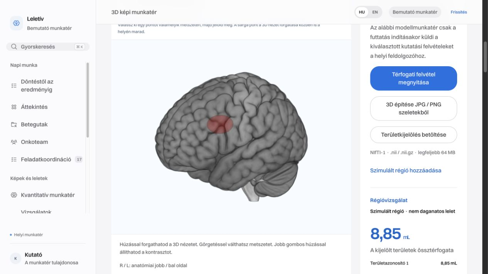

Az agyi atlasz forgatható térfogati nézete, rávetített területkijelöléssel és mérési panellel. **A piros régió mesterséges szemléltetés, nem felismert daganat.**

<table>
  <tr>
    <td width="50%"><strong>Metszetek és 3D együtt</strong><br><a href="docs/screenshots/brain-slices.jpg">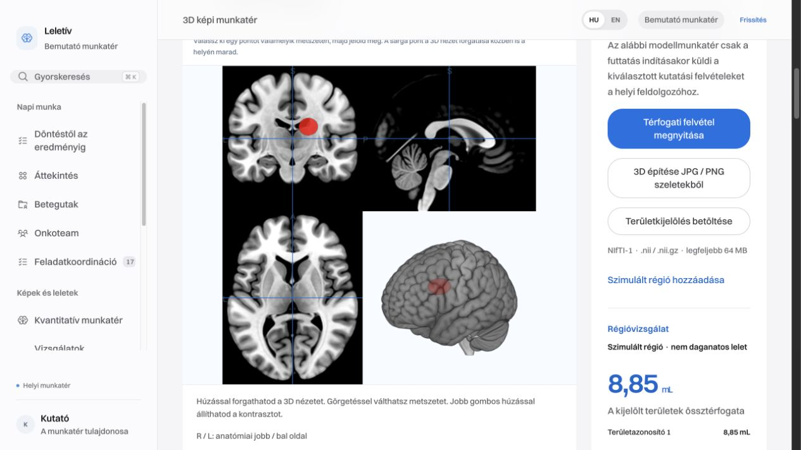</a><br>A térben összetartozó nézeteken ugyanaz a jelölt régió ellenőrizhető.</td>
    <td width="50%"><strong>PET/CT aktivitásrégiók</strong><br><a href="docs/screenshots/pet-ct.jpg">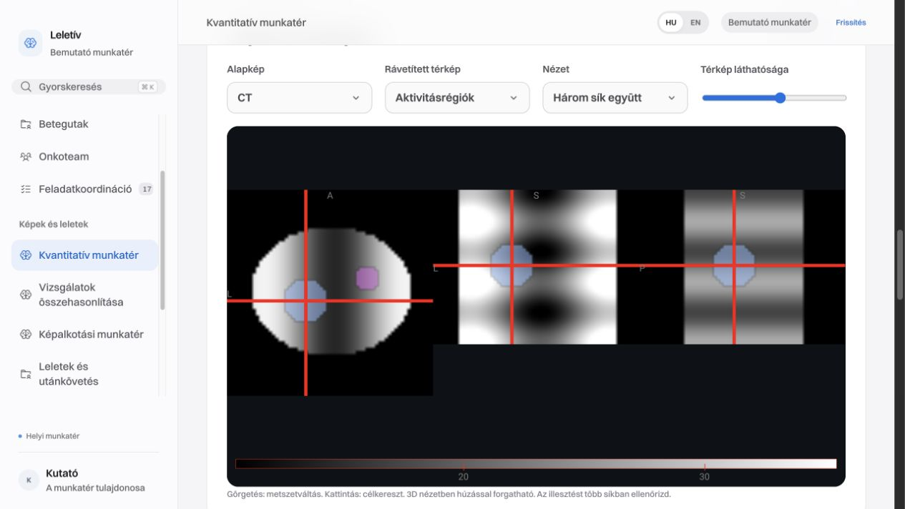</a><br>Kijelölt aktivitásrégiók megjelenítése CT-alapképen, generált geometriai próbán.</td>
  </tr>
  <tr>
    <td><strong>Digitális szövettan</strong><br><a href="docs/screenshots/histology.jpg">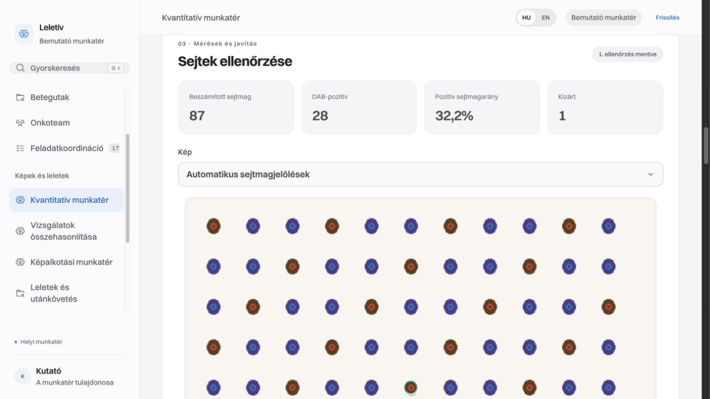</a><br>Sejtmagjelölések, javítható besorolás és pozitivitási összesítés mesterséges mintán.</td>
    <td><strong>Végigkövethető demóbetegút</strong><br><a href="docs/screenshots/case-pathway.jpg">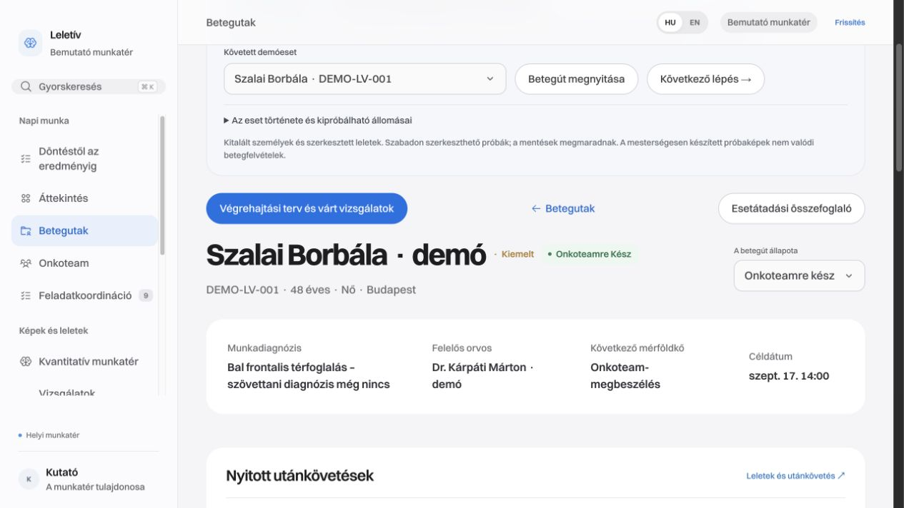</a><br>Esetösszefoglaló, munkadiagnózis, felelős és következő lépés egy helyen.</td>
  </tr>
</table>

A képernyőképek a ténylegesen futó alkalmazásból készültek, 2026. szeptember 15-én. A betegút és a kvantitatív példák kitalált adatokkal működnek. Az agyi képek MNI152/ICBM populációs atlaszt mutatnak, nem egy beteg felvételét. [Képek forrása és felhasználási feltételei](docs/screenshots/README.md). A képekre kattintva megnyitható a teljes méretű változat.

## Új kvantitatív munkatér

Öt helyben futó, API-kulcs nélküli kutatási munkafolyamat került a felületre: elváltozáskövetés automatikus illesztéssel és RECIST-munkalappal; 3D szervtérkép és L3-testösszetétel; PET/CT fúzió és SUV/TLG-mérések; szövettani sejtmag-pozitivitás; diffúziós és perfúziós MR. Az eredmények javíthatók, ellenőrzési előzménnyel menthetők és PDF/JSON formában exportálhatók. A mintaadatok csak kifejezett indításkor, helyben generálódnak.

[Részletes funkciók, bemenetek, telepítés és korlátok](docs/ADVANCED-WORKSPACE.md) · [További komponensek és modellek licencei](docs/ADVANCED-THIRD-PARTY.md).

## Mit tartalmaz a nyilvános repó?

Forráskódot, adatbázissémát, teszteket, modellletöltő kódot, dokumentációt és a bemutató-képernyőképeket. **Az alkalmazás üres munkatérrel indul:** nincsenek előre feltöltött esetek, betegrekordok, leletek, képanyagok, munkatársak vagy eseménynaplók. A helyi adattár, a korábbi munkatér állapota, az AI-modellsúlyok és a feldolgozható tesztképanyagok nem részei a repónak. Az új indítás nem emel át korábbi telepítésből adatokat.

A felület alapértelmezésben magyar, HU/EN nyelvváltóval. A legújabb összekapcsolt betegút- és képösszehasonlító modulok egyes szövegei jelenleg csak magyarul érhetők el. A megjelenés Switzer betűtípust, visszafogott színeket, áttekinthető kártyákat és nagyobb vezérlőket használ.

## Funkciók oldalanként

### Kvantitatív képi munkatér — `/advanced`

Öt külön modul közös képi ellenőrzéssel, módosítható eredményekkel és mentett ellenőrzési előzményekkel:

1. **Elváltozások követése:** kiinduló és legfeljebb négy kontrollvizsgálat térbeli illesztése, a kijelölt elváltozások párosítása és térfogatváltozása. Az orvos által ellenőrzött átmérőkkel RECIST 1.1 munkalap készíthető. A párosítás javítható; a rendszer nem választ terápiát, és a RECIST-munkalap nem helyettesíti az agyi gliómák RANO-értékelését.
2. **3D szervtérkép és testösszetétel:** szervek automatikus körülhatárolása CT-n a helyi TotalSegmentator modellel; az L3 csigolya szintjében izom- és zsírszövetmérés a Stanford MIMI modellel. Mérhető keresztmetszeti terület, átlagos CT-denzitás és a testmagasságra normalizált vázizomindex. A szervek körülhatárolása nem általános daganatfelismerés.
3. **PET/CT elemzés:** a kalibrált PET-aktivitás rávetítése a CT-re, SUVmean/SUVmax és régiótérfogat mérése. FDG-felvételen TLG is számolható; az összesítésbe a felhasználó által kijelölt régiók kerülnek. Az élettani halmozás elkülönítése szakértői ellenőrzést igényel.
4. **Digitális szövettan:** sejtmagok felismerése és DAB-pozitivitás mérése a patológus által kijelölt képrészleten. A sejtek pozitív, negatív vagy kizárt besorolása javítható. Ez nem automatikus rákdiagnózis; a pozitív arány nem önmagában hitelesített Ki-67-index.
5. **Multiparametrikus MR:** ADC-számítás DWI-sorozatból, DSC-alapú relatív perfúziós becslés és normál referenciaszövethez viszonyított rCBV. A térképek közösen megjeleníthetők, a kijelölt területek mérési adatai összehasonlíthatók. Nincs automatikus progresszió- vagy sugárnekrózis-diagnózis.

A feldolgozások esethez kapcsolhatók. Korábbi feldolgozás képe átvehető új bemenetként; a kapcsolat és az ellenőrzési változat megmarad. A jelentés magyar szervneveket és módszerleírásokat használ, a mérési adatok változatlanul megőrződnek. **PDF:** a külön jelentésoldal a böngésző nyomtatási ablakából menthető. **JSON:** a részletes eredmények, paraméterek és ellenőrzési előzmények letölthetők.

### Végigkövethető bemutatóbetegutak — minden oldalon

Az üres alkalmazásban a **Három demóbetegút betöltése** gomb három, kizárólag kitalált esetet hoz létre: neuro-onkológiai kivizsgálást, szövettani leletre váró mellkasi esetet és neuro-onkológiai utánkövetést. Esetenként két szerkesztett lelet, forrásidézetek, mérések, négy feladat, három végrehajtási lépés, várt vizsgálat, utánkövetés és két generált 3D próbakép segíti a kipróbálást.

A **Követett demóeset** választó és a **Következő lépés** gomb végigvezet az összetartozó oldalakon. A mentések megmaradnak, az ismételt demóbetöltés nem írja felül a korábbi módosításokat. A generált képek a működést szemléltetik; nem a szöveges leletekben leírt anatómia másolatai. [Részletes útmutató](docs/DEMO-BETEGUTAK.md).

### Áttekintés — `/`

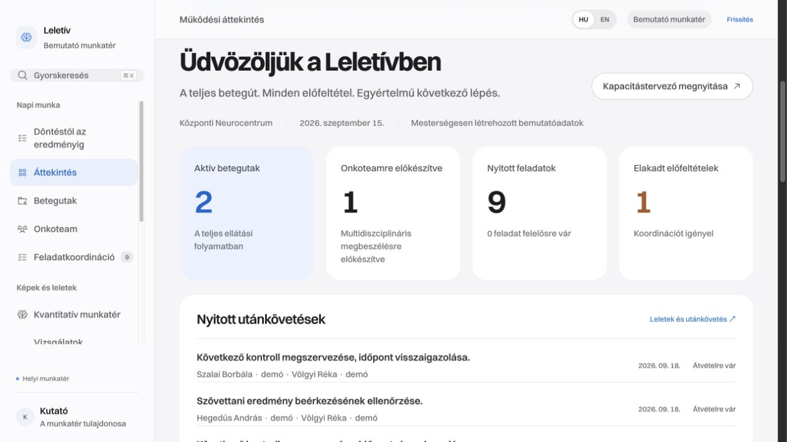

Az aktív esetek, onkoteamre előkészített esetek, nyitott teendők és elakadt előfeltételek közös áttekintése. A betegút szakaszaira kattintva szűrhetők az esetek. Láthatók a következő mérföldkövek, a felelőst igénylő feladatok, a visszajelzésre váró utánkövetések és a munkatérben rögzített legutóbbi változások. Az adatok a helyi nyilvántartásból származnak, nem kórházi rendszerek élő adatai.

### Esetnyilvántartás — `/cases`, `/cases/:caseId`


Új szintetikus eset rögzítése, keresés és szűrés, prioritás és betegútszakasz követése. Az esetlap összefogja a munkadiagnózist, az esetösszefoglalót, a kapcsolódó feladatokat, az előkészítettségi követelményeket, a képalkotó vizsgálatokat és az onkoteam-döntéseket. A rögzített változások újratöltés után is megmaradnak.

### Esetátadó összefoglaló — `/cases/:caseId/brief`

Az adott esetből készülő, nyomtatható átadó dokumentum a következő ellátó vagy megbeszélés számára. **PDF-be menthető a böngésző nyomtatási ablakán keresztül.** A dokumentum a rögzített adatokat rendezi össze; nem automatikus orvosi szakvélemény. A közös oldalfejléc PDF / nyomtatás gombja a többi oldal böngészős nyomtatását is elindítja; az esetátadó külön nyomtatási elrendezést kapott.

### Onkoteam — `/board`

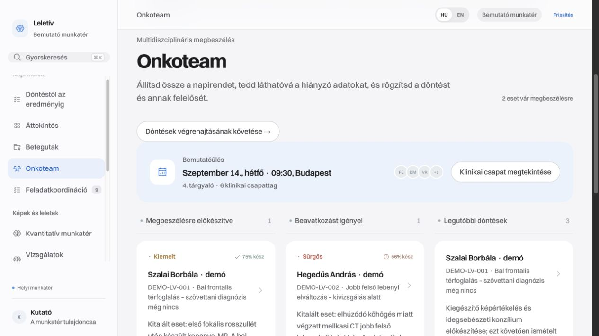

Az esetek multidiszciplináris megbeszélésre való előkészítettségének áttekintése. A szükséges feltételek állapota módosítható; az ajánlás, az indoklás és a rögzítő személy dokumentálható. A döntést az orvos vagy a felhasználó adja meg, az alkalmazás nem választ terápiát.

### Döntéstől az eredményig — `/care`

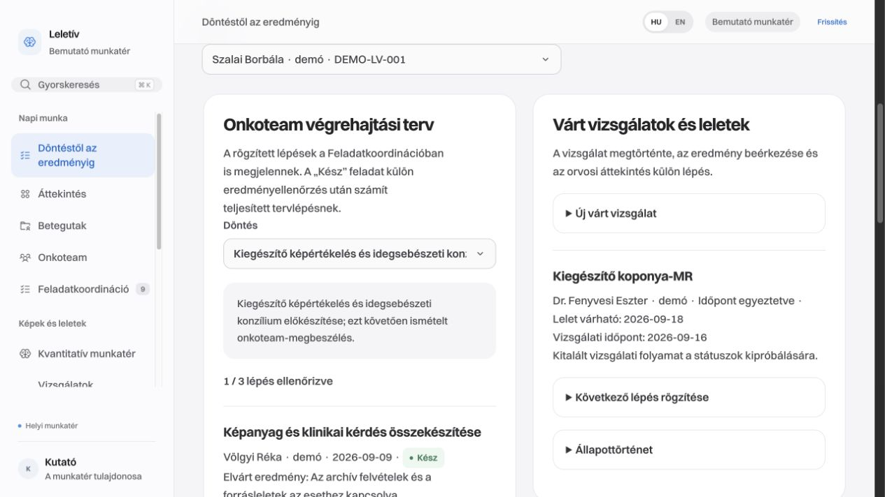

Az onkoteam-döntés végrehajtási lépésekre bontható. Minden lépéshez felelős, határidő, elvárt eredmény és előfeltétel rendelhető; a lépés a feladatlistán is megjelenik. A munka befejezése és az eredmény ellenőrzése külön állapot. Ellenőrzött előfeltétel nélkül a következő lépés nem zárható le ellenőrzöttként.

Ugyanitt nyilvántarthatók a várt vizsgálatok: időpont-egyeztetés, elvégzés, leletbeérkezés és áttekintés. A beérkező eredményhez az eset dokumentuma vagy archivált képanyaga kapcsolható. A módosítási előzmények megmaradnak, az elavult verzióból érkező módosításokat a rendszer visszautasítja. Ez belső követés; nincs EESZT-leletlekérés vagy automatikus időpontfoglalás.

### Képalkotási munkatér — `/imaging`

Esethez kötött képalkotó vizsgálatok nyilvántartása és fájlok feltöltése. A metaadatok D1-adatbázisban, a feltöltött fájlok R2-objektumtárban tárolódnak; az alapértelmezett indítás mindkettőt helyben emulálja. Az archivált NIfTI-kép megnyitható a 3D nézőben. A feltöltés nem PACS-integráció és nem automatikus anonimizálás.

### 3D képi munkatér — `/volume-lab`


- NIfTI-1 képtérfogatok megnyitása axiális, koronális és szagittális metszetekben, valamint forgatható 3D nézetben.
- Kontraszt, a kijelölés láthatósága és térbeli metszősík beállítása.
- **JPG/PNG és a böngésző által dekódolható képszeletek sorozatából térfogati nézet készítése.** A szeletsorrend és a távolságok megadásával a létrehozott térfogat NIfTI-ként letölthető. Ez a képsorozat térbeli megjelenítése: nem állít helyre hiányzó anatómiát, nem igazolja a szeletek helyes illeszkedését, és nem automatikus agyszegmentálás.
- DICOM-sorozatok helyi, böngészőben végzett NIfTI-konverziója a dcm2niix segítségével. A konverzió nem végez képi regisztrációt vagy koponyamentesítést.
- Képhez rögzített térbeli pontjelölő, amely forgatáskor is ugyanarra a képi helyre mutat, és visszakereshető. Nem daganathatár.
- Azonos térbeli geometriájú régiómaszk importálása; kijelölt területenkénti térbeli képpontszám és ismert fizikai kalibráció esetén térfogat számítása. CSV-méréslista és NIfTI-maszk exportálható.
- Félautomatikus régiónövesztés egy kiválasztott pontból, intenzitástartomány és maximális sugár megadásával. Ez determinisztikus képfeldolgozás, nem AI-diagnózis.
- Archív forráshoz kapcsolható maszk, régióazonosító, módszer, paraméterek és megjegyzés. Mentéskor a szerver ellenőrzi a forrás fájlazonosságát és a maszk geometriáját, újraszámolja a térfogatot. A forrás és a maszk később visszanyitható.

### Agyi MR kutatási szegmentálása — a 3D munkatéren belül

Helyi Python-szolgáltatás futtatja a MONAI BraTS előtanított modelljét. **Négy megfelelően előkészített MR-szekvencia szükséges: T1, kontrasztos T1, T2 és FLAIR.** A modelljelölések megnyithatók a nézőben; elérhető a feldolgozás állapota, megszakítása, az ideiglenesen megőrzött futás visszanyitása és az eredetadatok exportja.

A becsült régiók kutatási kimenetek. A rendszer nem általános agydaganat-kereső és nem igazolt műtéti vagy sugárterápiás tervezőrendszer. Az előkészítés követelményeit és a korlátokat az [inferencia dokumentációja](inference/README.md) részletezi.

### Tüdőgócjelöltek — a 3D munkatéren belül

A MONAI RetinaNet előtanított tüdőgócdetektora megfelelő mellkasi CT-ből jelöltlistát, detektorpontszámot és térbeli befoglaló dobozokat ad. A jelöltre kattintva a megfelelő képi helyhez lehet ugrani; áttekintési megjegyzés és JSON-export készíthető.

A bemenet ismert orientációjú, milliméterben kalibrált, HU-intenzitású NIfTI CT. **JPG/PNG-sorozat nem megfelelő ehhez a modellhez.** A pontszám nem a rosszindulatúság valószínűsége; a doboz nem szegmentációs maszk, így nem használjuk góctérfogatként. Negatív eredmény nem zár ki betegséget. A helyi CPU-profil teljesítményét nem validáltuk klinikai használatra.

### Kiinduló és kontrollvizsgálat összehasonlítása — `/compare`

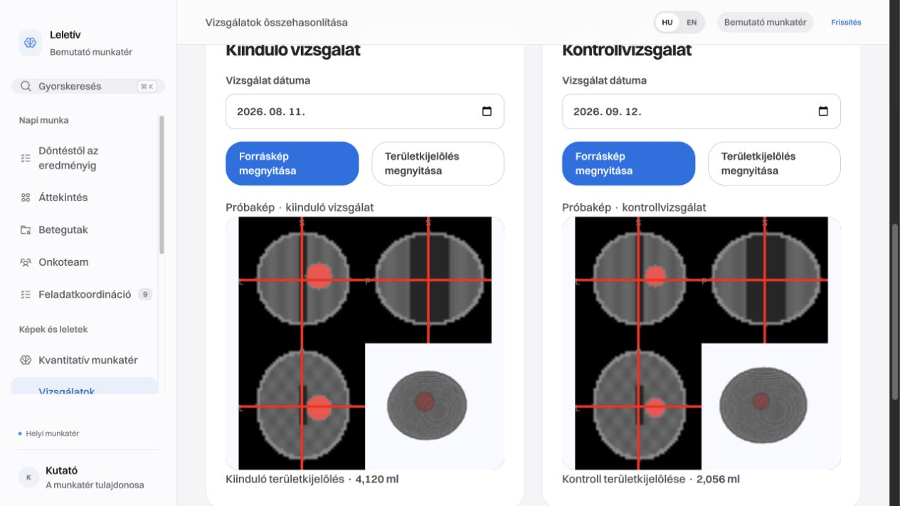

Két NIfTI-vizsgálat és hozzájuk tartozó régiómaszk egymás melletti megnyitása. Egyező geometrián és a felhasználó által megerősített regisztráció mellett szinkronizálható a nézet. A kijelölt régiók térfogata, abszolút és százalékos eltérése összevethető. A közös, megjelent és eltűnt maszkterületek változástérképen ábrázolhatók, NIfTI- és JSON-exporttal.

Az alkalmazás nem regisztrál automatikusan két vizsgálatot. A maszkeltérés önmagában nem progresszió, és az eredmény nem automatikus RECIST- vagy RANO-minősítés.

### Leletáttekintés és utánkövetés — `/review`

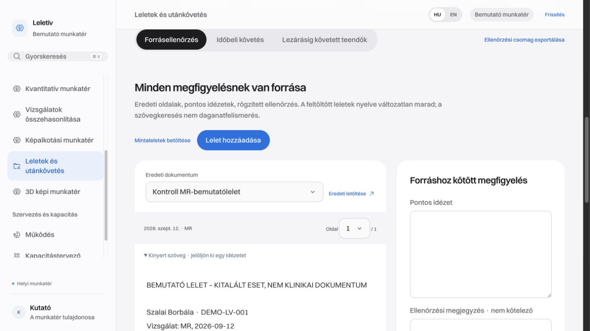

PDF- vagy szöveges lelet feltöltése, kinyerhető szöveg áttekintése, pontos forrásidézetek és oldalszámok rögzítése. A PDF eredetije visszanyitható. A megfigyelésekhez áttekintő személy és ellenőrzési állapot tartozik. A szövegkinyerés nem OCR: kép formájában beszkennelt leletekhez külön OCR-feldolgozásra lehet szükség.

A forráshoz köthetők kézzel rögzített mérések, vizsgálati dátumok, mérési módszerek és összehasonlíthatósági feltételek. Követhető a változás, indoklással érvényteleníthető hibás mérés. A további teendő felelőshöz és határidőhöz rendelhető, lezárásához külön eredményforrás és dokumentált áttekintés szükséges. Az ellenőrzési csomag JSON-formátumban exportálható. Az alkalmazás nem talál ki leleti tartalmat és nem generál terápiás javaslatot.

### Feladatkoordináció — `/tasks`

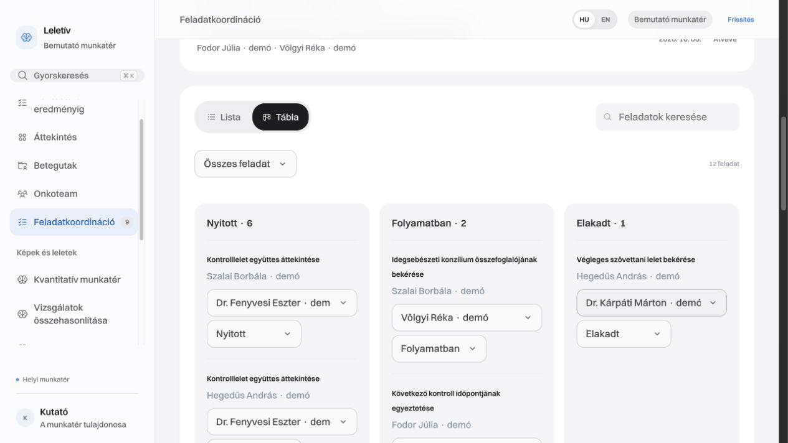

Esethez kötött teendők létrehozása, felelős hozzárendelése, prioritás, határidő és állapot kezelése. Lista- és táblanézet segíti a nyitott, folyamatban lévő, elakadt és befejezett munka áttekintését. Az ellenőrzött végrehajtási lépésekhez kapcsolt feladatokat lezárási védelem óvja a csendes visszanyitástól.

### Erőforrások és függőségek — `/operations`

A nyilvántartott erőforrások állapotának és az esetek közötti függőségeknek az áttekintése. Láthatók az elakadást okozó feltételek és a kapcsolódó felelősök. Ez áttekintő felület, nem élő műszakbeosztás, kórházi eszközvezérlés vagy teljes erőforrás-adminisztráció. Az üres telepítés nem tartalmaz intézményi erőforrás-adatokat.

### Kapacitáslabor — `/scenarios`

„Mi történne, ha?” szimuláció a képalkotás, a műtő és a megfigyelési kapacitás összefüggéseinek vizsgálatára. Módosíthatók a kapacitások, a beérkezési hullámok és például az MR-kiesés feltételezései. Megtekinthetők a becsült várakozások és az egyes szimulált utak. A forgatókönyv a forrásesetek pillanatképével menthető, az elemzés CSV-be exportálható. A modell feltételezéseken alapuló demonstráció, nem validált intézményi kapacitás-előrejelzés.

### Szakmai csapat — `/team`

Fiktív munkatárs felvétele névvel, szerepkörrel és szakterülettel. Az oldalon áttekinthetők a rögzített szerepkörök, az elérhetőség és a hozzárendelt feladatok terhelése. A munkatárs rekordja nem bejelentkezési fiók; a kiválasztott áttekintő neve nem hitelesített elektronikus aláírás.

## Gyors indulás

Node.js **22.13 vagy újabb** szükséges; a képi nézetekhez WebGL2-képes böngésző ajánlott.

```bash
npm ci
npm run dev
```

Nyissa meg a **http://127.0.0.1:5173/** címet. Az indító automatikusan alkalmazza a helyi adatbázis-migrációkat. Az alapalkalmazáshoz nem kell Cloudflare-fiók vagy API-kulcs.

**Meglévő telepítés frissítése:** az új telepítés helyi képtárának azonosítója `leletiv-imaging`. Korábbi képtár megtartásához az indító második argumentumában annak meglévő azonosítója adható meg: `npm run dev -- 5173 KORABBI_KEPTAR_AZONOSITO`. Az indító nem másolja és nem törli a képtárakat. A korábbi adatbázishoz az ahhoz tartozó képtárat kell használni, különben a régi képanyagok nem lesznek elérhetők. A kliens és a Python-szolgáltatás azonos kiadását használja; a helyi kérések fejléce `X-Leletiv-Research`.

A teljes bemutatóhoz válassza a **Három demóbetegút betöltése** gombot. Saját szintetikus munkatér kialakításához:

1. A **Szakmai csapat** oldalon vegyen fel egy fiktív munkatársat.
2. Az **Esetnyilvántartásban** hozzon létre egy szintetikus esetet.
3. Rögzítsen hozzá teendőt vagy onkoteam-döntést, majd kövesse a **Döntéstől az eredményig** oldalon.
4. A képi eszközöket külön is kipróbálhatja megfelelő, szintetikus képfájlokkal.

### Switzer betűtípus

A felület továbbra is a **Switzer** családot használja, ha az a gépen telepítve van. A font nem nyílt forrású: a fájljait és harmadik féltől származó újracsomagolását nem terjesztjük a repóval. A teljes családot a [Fontshare hivatalos oldaláról](https://www.fontshare.com/fonts/switzer), az [ITF feltételeinek](https://www.fontshare.com/licenses/itf-ffl) elfogadásával lehet beszerezni és az operációs rendszerben telepíteni. Ezután indítsa újra a böngészőt, ha szükséges.

Telepített Switzer nélkül a böngésző a CSS-ben megadott Arial/sans-serif tartalékot használja; a betűk szélessége ezért eltérhet. Az alkalmazás nem kér le külső fontot. Távoli vagy mobil használathoz a betűtípus webes terjesztését külön, a jogosult feltételei szerint kell rendezni.

### A helyi modellek külön telepítése

Python **3.12** és a csomagokhoz elegendő tárhely/memória szükséges. A jelenlegi parancsok macOS/Linux környezetre készültek; natív Windows-telepítést nem ellenőriztünk.

```bash
python3.12 -m venv .venv-inference
.venv-inference/bin/python -m pip install -r inference/requirements.txt
npm run inference:model
npm run inference:lung-model
npm run dev:full
```

A modellsúlyok nyilvános forrásból, rögzített verzióval és SHA-256-ellenőrzéssel tölthetők le. A futó modell a helyi **127.0.0.1:8789** címen érhető el. API-kulcs nem szükséges. A két indítót ne futtassa egyszerre ugyanazon a porton.

### Az öt kvantitatív modul telepítése

Az előző Python-környezetben:

```bash
npm run advanced:setup
npm run advanced:body-model
npm run dev:full
```

A testösszetételi és szervmodell külön letöltést igényel. Az elváltozáskövetés, a PET-mérések, a sejtmagok képfeldolgozása és az MR-számítások nem igényelnek fizetős API-t. A teljesen összekapcsolt bemutató előkészítéséhez, a futó alkalmazás mellett egy másik terminálban:

```bash
npm run demo:seed
```

A betegutak Python nélkül is betölthetők; a kvantitatív mintákhoz a helyi képfeldolgozónak futnia kell.

### Választható képi példák

```bash
npm run demo:images
```

A Python-környezet telepítése után ez helyben generál geometriai DICOM- és NIfTI-próbaképeket, továbbá letölti a hivatkozott MNI152 populációs agyatlaszt. Ezek nem betegfelvételek. A generált és letöltött képek Git által figyelmen kívül hagyott fájlok; a repóban csak az előállító kód és az atlasz [forrásmegjelölése](public/volumes/ATTRIBUTION.txt) szerepel. Az atlaszgombhoz és az önálló képi példákhoz ez a külön lépés szükséges. A három kapcsolt demóbetegút képeit a demóbetöltés külön letöltés nélkül állítja elő.

## Ellenőrzés

```bash
npm run check
npm run test:empty
npm run inference:test
```

Az első parancs típusellenőrzést, TypeScript-teszteket és kliens/Worker buildet futtat. A második izolált, üres D1/R2 környezetből indulva ellenőrzi a fő API-műveleteket és az újranyitás utáni megőrzést. A Python-tesztekhez külön inferenciakörnyezet szükséges. Ezek szoftveres tesztek, nem klinikai validációk.

A 2026. szeptember 15-i kiadási ellenőrzés eredményeit és határait a [működésellenőrzési jegyzőkönyv](docs/RELEASE-VERIFICATION.md) tartalmazza.

## Technikai felépítés

React, TypeScript és Vite kliens; Hono Worker API; D1 strukturált tárolás; R2 fájltárolás; NiiVue képi néző; dcm2niix WASM DICOM-konverzió; FastAPI, PyTorch és MONAI a helyi inferenciához. Az alapindítás loopback interfészen szolgál ki, a tárolók helyi emulációját használja. A forráskód publikálása nem telepít élő szolgáltatást.

A képi nézőbe megnyitott fájl önmagában a böngészőben marad. A modellfuttatás a kiválasztott fájlt a helyi Python-szolgáltatásnak adja át; az archívumba mentés külön művelet. Sem általános felhős LLM, sem fizetős orvosi API nincs bekötve.

## Mi szükséges a klinikai irányú továbblépéshez?

- A konkrét feladatra kialakított, szakértőileg annotált értékelési adathalmaz és összehasonlítható teljesítménymérés.
- Radiológus/onkológus által értékelt használhatósági vizsgálat és dokumentált hibaforgatókönyvek.
- Hitelesített felhasználók, szerepkörös hozzáférés, megfelelő adatvédelmi folyamatok és üzembiztonság.
- Ellenőrzött előfeldolgozás, intézményi integráció és az alkalmazási célnak megfelelő szabályozási értékelés.

Nem állítunk hazai piaci kizárólagosságot, igazolt diagnosztikai pontosságot vagy klinikai termékekkel való egyenértékűséget.

## Licenc és közreműködés

A projekt saját forráskódja **Apache-2.0** licencű. A függőségek, a külön letöltött modellek és az atlasz megtartják saját licencfeltételeiket; lásd [THIRD_PARTY_NOTICES.md](THIRD_PARTY_NOTICES.md). A licenc nem jelent orvostechnikai engedélyt.

A kiadás garanciavállalás nélkül érhető el, az Apache-2.0 7–9. pontjainak és az alkalmazandó kötelező jognak megfelelően. A klinikai korlátokat, a felelősségi rendelkezések határait és a továbbterjesztés szempontjait a [LEGAL.md](LEGAL.md) ismerteti. A szerzői jogi jelölés a [NOTICE](NOTICE) fájlban található. Ezek a tájékoztatók nem módosítják a szabványos licencet, és nem garantálnak teljes felelősségmentességet.

Hibajelentéshez és példákhoz kizárólag szintetikus adatokat használjon. Ne csatoljon betegadatot, intézményi leletet, belépési adatot vagy teljes alkalmazásnaplót. Részletek: [CONTRIBUTING.md](CONTRIBUTING.md), [SECURITY.md](SECURITY.md).
